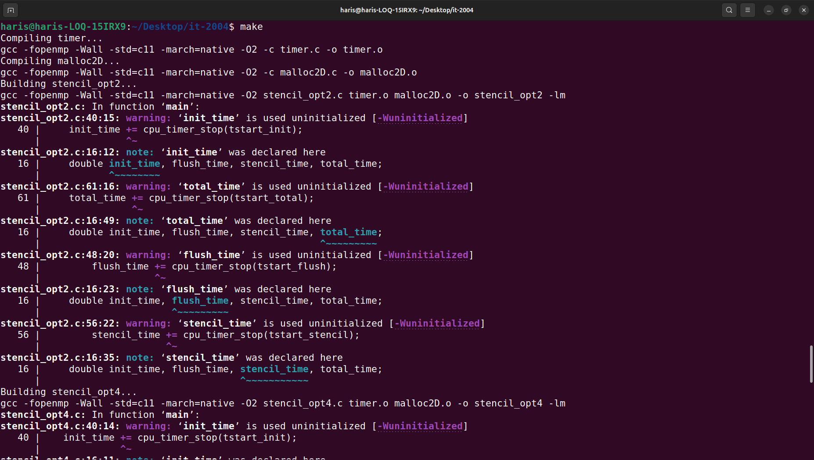
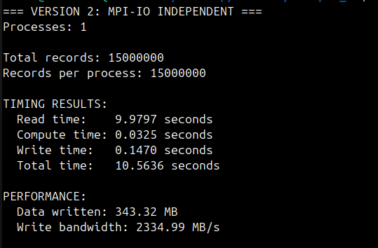

# IT 2004 - Parallel Programming 
GitHub Repository for Assignment Submissions for Parallel Programming.

## Assignment 7
- Implemented everything in PartialSum
- Added results.txt
- Modified Makefile to be able to run with 8 processes

### Output after running 4, 6 and 8 processes

### Code Explanation
-

### Questions & Answers